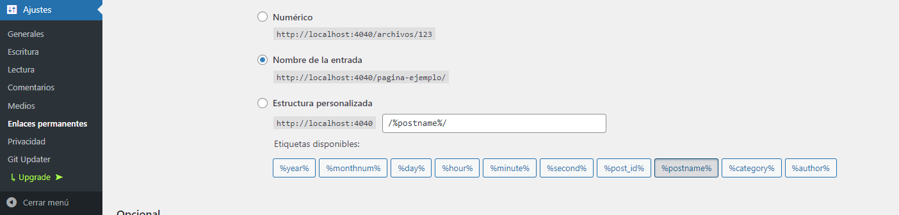

# Historia del Internet


- [Historia del Internet](#historia-del-internet)
  - [WordPress local para el desarrollo](#wordpress-local-para-el-desarrollo)
  - [Instalar paquetes](#instalar-paquetes)
    - [Instalar manualmente](#instalar-manualmente)
    - [Estos se instalan usando el plugin Git Updater](#estos-se-instalan-usando-el-plugin-git-updater)
    - [Estos se pueden instalar directamente desde WordPress](#estos-se-pueden-instalar-directamente-desde-wordpress)
  - [Preparar WordPress para usarlo en modo descabezado](#preparar-wordpress-para-usarlo-en-modo-descabezado)

## WordPress local para el desarrollo

Sólo es necesario si se necesita crear una instancia de wordpress local para desarrollo y pruebas.

Con Docker instalado, iniciar contenedor con:

```bash
yarn servidor:dev
```

Cambiar la ruta a donde se hacen las peticiones:

**/aplicaciones/www/fuente/utilidades/constantes.ts**

```js
export const apiBase = 'http://localhost:4040';
```

## Instalar paquetes

Estos son los paquetes que se usan.

### Instalar manualmente

Git Updater: Para actualizar temas y plugins que subimos a GitHub.

https://git-updater.com/

Descargar el .zip y subirlo manualmente para instalar.

### Estos se instalan usando el plugin Git Updater

Ir a Ajustes->Git Updater para instalar temas y extensiones desde Github.

- https://github.com/enflujo/enflujo-historia-internet-config
- https://github.com/jsongerber/wp-sync-db
- https://github.com/jsongerber/wp-sync-db-media-files

### Estos se pueden instalar directamente desde WordPress

- WPGraphQL: para usar GraphQL.
- Pods: Para crear campos personalizados (modelo de datos)

## Preparar WordPress para usarlo en modo descabezado

Primero hay que asegurarse que WordPress resuelva los enlaces en el formato `/%postname%/`:

Ir a: **Ajustes -> Enlaces Permanentes** y seleccionar la opción `Nombre de entrada` para que las url resuelvan: http://urldelsitio/**%postname%/**


